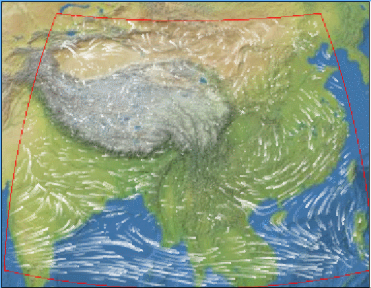

# 这种实现方式效率太低了
# This implementation is too inefficient

# cesium-wind
implement dynamic wind in Cesium

## 示例

## 数据源
你从[index.js](./src/index.js)中可以看到我使用的是[uvwind_d01.json](./src/data/uvwind_d01.json)数据。
数据可以按照你的方式进行组织，只要方便读取，我只解释下这个数据的格式。

风场数据由风速X分量和Y分量组成，每个分量格式都是一致的：

* data (Array)
当前分量每个格点的风速大小(m/s)。

* header (Object)
描述风场信息是如何组织的

* meta (Object)
描述风场的一些基本信息，如日期等。

## 方法

## 总结
目前在Cesium中实现动态风场，使用Cesium.PolylineGeometry几何元素进行模拟，效果仍然不满意，应该有更好的方法。
